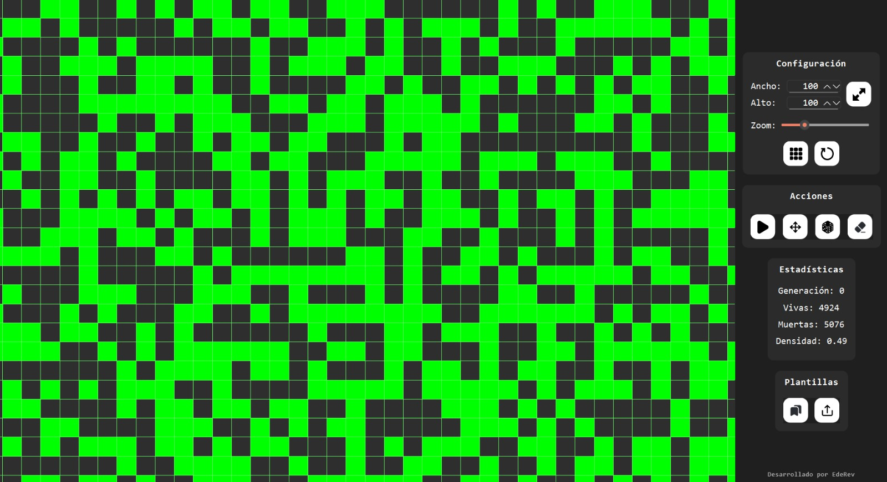

# Conway's Game of Life

Un simulador de escritorio del clásico Juego de la Vida de Conway con interfaz gráfica moderna, controles intuitivos y funcionalidad completa de guardado/carga de patrones.


_Captura de pantalla del simulador en funcionamiento_

## Características principales

- **Interfaz gráfica moderna** desarrollada en PyQt6
- **Controles de reproducción** completos (play, pausa, paso a paso, reset)
- **Zoom y navegación fluida** por el tablero infinito
- **Guardado y carga de patrones** en formato JSON estándar
- **Dibujado interactivo** - haz clic para crear/eliminar células
- **Velocidad ajustable** de simulación
- **Contador de generaciones** en tiempo real

## Requisitos del sistema

- Python 3.8 o superior
- Sistema operativo: Windows, macOS o Linux
- Git (para clonar el repositorio)

## Instalación y configuración

### 1. Obtener el código fuente

```bash
git clone <URL_DEL_REPOSITORIO>
cd conway_game_life
```

### 2. Crear y configurar entorno virtual

**Windows:**

```bash
# Crear entorno virtual
python -m venv venv

# Navegar al directorio del entorno
cd venv

# Activar el entorno virtual
source Scripts/activate

# Regresar al directorio principal del proyecto
cd ..
```

**macOS/Linux:**

```bash
# Crear entorno virtual
python3 -m venv venv

# Navegar al directorio del entorno
cd venv

# Activar el entorno virtual
source bin/activate

# Regresar al directorio principal del proyecto
cd ..
```

### 3. Instalar dependencias

```bash
pip install -r requirements.txt
```

## Uso

### Ejecutar el simulador

```bash
python src/main.py
```

### Controles básicos

- **Clic izquierdo**: Activar/desactivar células (solo en modo edición)
- **Q**: Cambiar entre modo edición y modo navegación
- **Enter**: Reproducir/pausar simulación
- **Rueda del ratón**: Hacer zoom
- **Arrastrar**: Navegar por el tablero (solo en modo navegación)

### Menús disponibles

- **Archivo**: Nuevo, Abrir patrón, Guardar patrón, Salir
- **Simulación**: Play/Pausa, Paso, Reset, Velocidad
- **Ver**: Zoom In, Zoom Out, Ajustar a ventana
- **Ayuda**: Acerca de, Instrucciones

## Formato de plantillas JSON

Las plantillas siguen esta estructura estándar:

```json
{
  "width": 5,
  "height": 5,
  "alive": [
    [1, 0],
    [2, 1],
    [0, 2],
    [1, 2],
    [2, 2]
  ]
}
```

**Campos:**

- `width` y `height`: Dimensiones mínimas del tablero
- `alive`: Array de coordenadas [x, y] de células vivas

## Crear ejecutable independiente (Opcional)

Para usuarios que deseen distribuir el programa como un archivo ejecutable único:

### Instalar PyInstaller

```bash
pip install pyinstaller
```

### Generar ejecutable

**Windows:**

```bash
pyinstaller --onefile --windowed --name "Game of Life" --icon=assets/app/app.ico --add-data "assets/icons;assets/icons" src/main.py
```

**macOS/Linux:**

```bash
pyinstaller --onefile --windowed --name "Game of Life" --icon=assets/app/app.ico --add-data "assets/icons:assets/icons" src/main.py
```

El ejecutable se generará en la carpeta `dist/`.

**Nota:** El separador en `--add-data` varía según el sistema:

- Windows: `;` (punto y coma)
- macOS/Linux: `:` (dos puntos)

## Solución de problemas

### Python no reconocido

- Asegúrate de que Python esté instalado y agregado al PATH del sistema
- En Windows, puedes usar `py` en lugar de `python`

### Error de permisos (Windows)

- Ejecuta la terminal como administrador
- Configura la política de ejecución: `Set-ExecutionPolicy -ExecutionPolicy RemoteSigned -Scope CurrentUser`

### El entorno virtual no se activa

- Verifica que estés en el directorio `/venv/` antes de ejecutar el comando de activación
- En Windows, usa `Scripts/activate` (no `bin/activate`)

### Iconos SVG no aparecen en el ejecutable

- Asegúrate de que `PyQt6.QtSvg` esté importado en `main.py`
- Verifica que la carpeta `assets/icons` exista y contenga los archivos SVG

### Rendimiento lento con patrones grandes

- Ajusta la velocidad de simulación en el menú
- Usa zoom para enfocar áreas específicas del tablero

## Contribuciones

Las contribuciones son bienvenidas. Para reportar bugs o solicitar nuevas características:

1. Abre un issue describiendo el problema o la mejora
2. Fork el repositorio y crea una rama para tu feature
3. Envía un pull request con una descripción clara de los cambios

## Licencia

Este software es **software libre** distribuido bajo licencia que permite:

- Libre distribución y uso personal
- Modificación del código fuente
- Distribución de versiones modificadas

**Restricciones:**

- Comercialización por terceros
- Uso comercial sin autorización del autor original

Únicamente el autor original conserva los derechos de comercialización.

## Posibles cambios futuros

El desarrollo del simulador continúa evolucionando. Estas son algunas mejoras planeadas para futuras versiones:

### Rendimiento y escalabilidad

- **Optimización del tablero**: Implementación de algoritmos más eficientes para el cálculo de generaciones
- **Aumento de límites del tablero**: Soporte para tableros de mayor tamaño sin impacto en el rendimiento
- **Renderizado optimizado**: Mejoras en la visualización para patrones complejos

### Interfaz y controles

- **Customización de velocidad avanzada**: Control más granular de la velocidad de simulación con valores personalizados
- **Más opciones de visualización**: Temas, colores personalizables, modos de visualización alternativos
- **Atajos de teclado configurables**: Personalización completa de controles por el usuario

### Análisis y métricas

- **Más métricas de simulación**: Estadísticas detalladas de población, estabilidad y evolución
- **Gráficos en tiempo real**: Visualización de datos estadísticos durante la simulación
- **Historial de patrones**: Seguimiento de la evolución de patrones específicos

### Funcionalidades adicionales

- **Biblioteca de patrones extendida**: Catálogo más amplio de patrones clásicos y modernos
- **Editor de patrones avanzado**: Herramientas de dibujo más sofisticadas
- **Exportación de animaciones**: Capacidad de exportar simulaciones como GIF o video
- **Modo de comparación**: Ejecutar múltiples variantes de un patrón simultáneamente

---

_Desarrollado con Python y PyQt6 | © 2025 - Software libre con restricciones comerciales_
